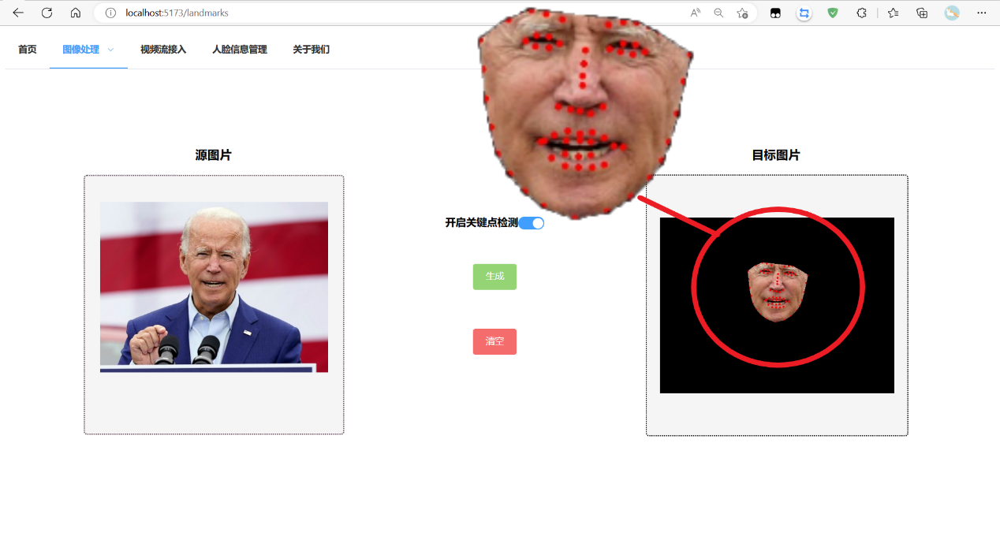
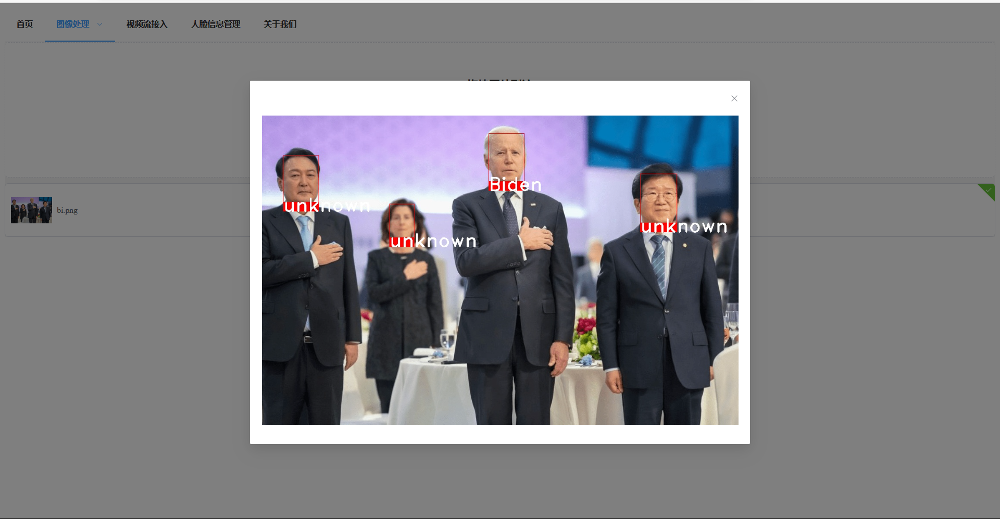
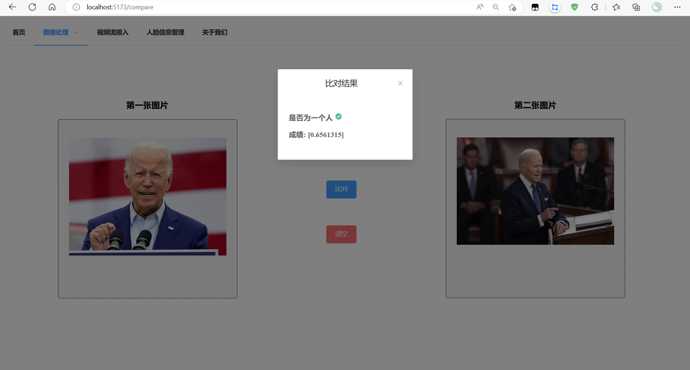
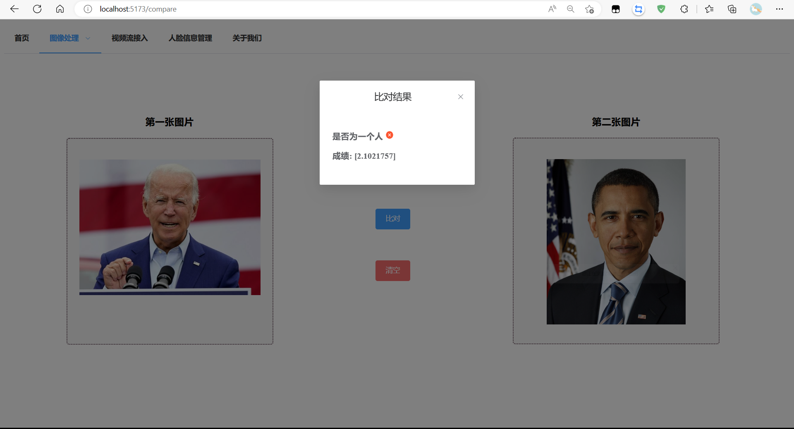
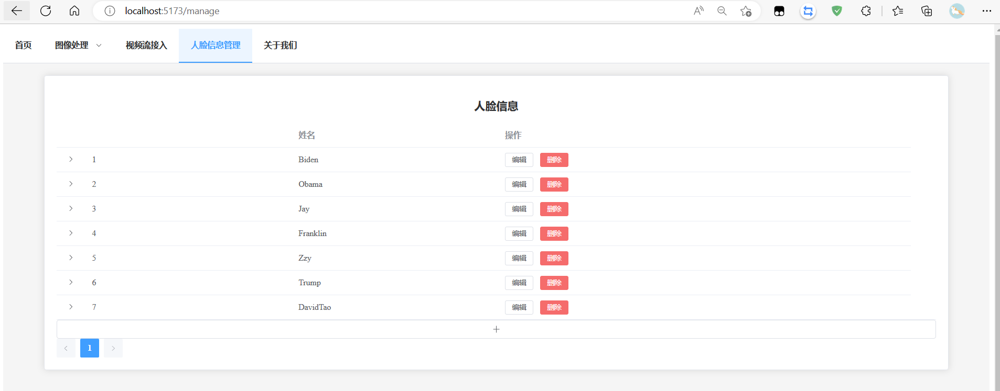

# De-styled secure face recognition system
## 1. Introduction
This is a development example of secure face recognition system that front and rear end separation . It is based on the face recognition package of [insightface](https://github.com/deepinsight/insightface.git) and the face anti-spoofing solution of [SSAN](https://github.com/wangzhuo2019/SSAN.git)
## 2. Requirement
- Python 3.6+
- npm 8.1.0+
- cuda 11.0+
  
## 3.  Usage
### 1. Install the dependencies
```bash
pip install -r requirements.txt
cd ./front/face_front
npm install
```
### 2.Start the server
```bash
cd ./front/face_front
npm run dev
cd ../../
cd ./back
python main.py
```
### 3. Open the browser and enter the address
```bash
http://localhost:5173
```

## 4.  Demo
### 1. Face slice
Use the face_slice to get the face image from the source image.We get the landmarks of faces before we get this.


### 2. Face recognition


### 3. Face compare



### 4. Face management
it can add,edit,delete the pre-existing face


### 5. Use webCamera


## 5. Future
- warning when the spoof appeared
- enable to use the local camera
- better performance


